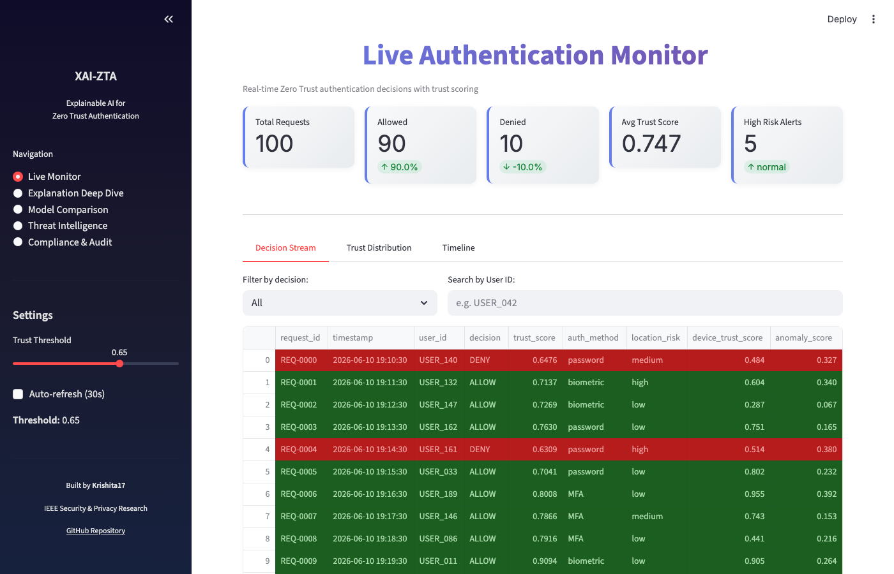
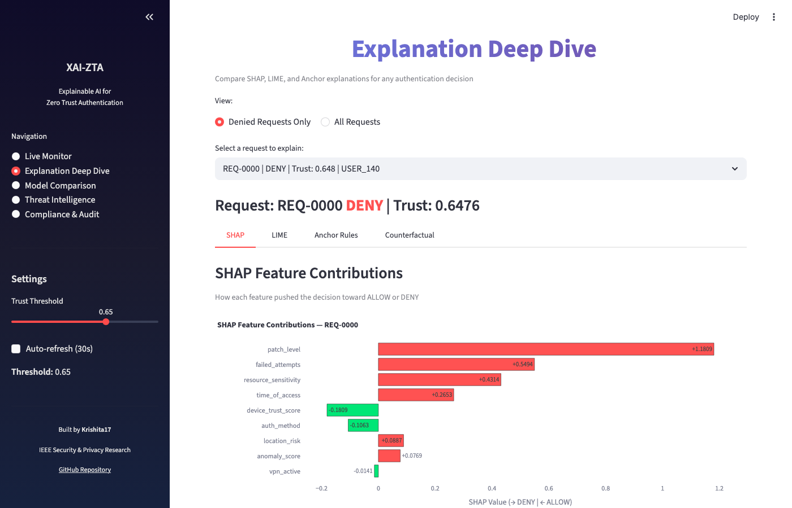
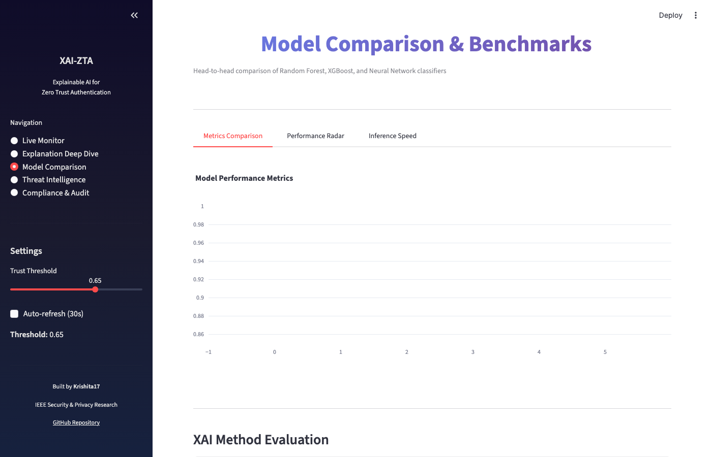
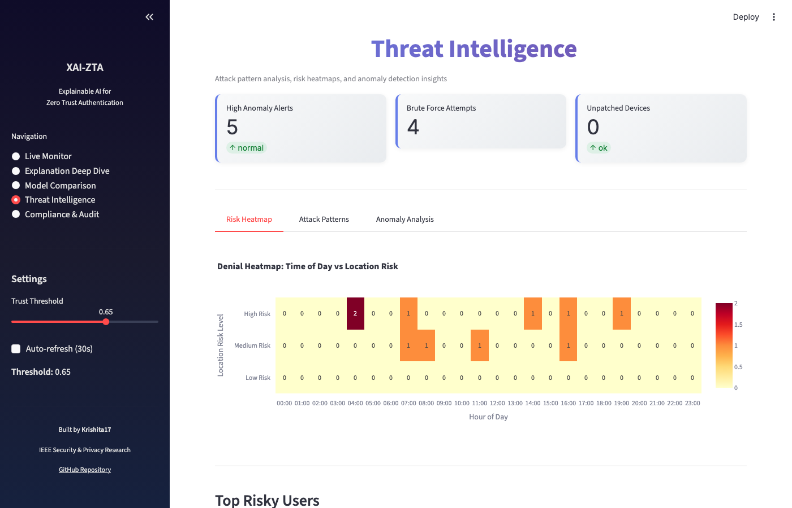
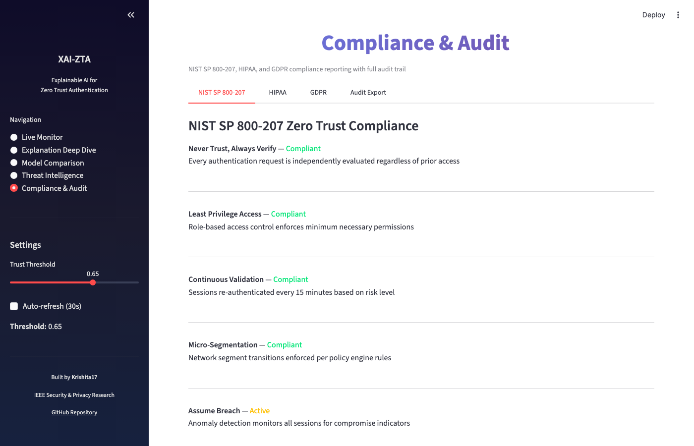

# XAI-ZTA: Explainable AI for Zero Trust Continuous Authentication

> **A complete research system that makes AI-driven access control decisions transparent, trustworthy, and auditable.**

[](https://python.org)
[](https://streamlit.io)
[](https://pytorch.org)
[](LICENSE)
[](https://csrc.nist.gov/publications/detail/sp/800-207/final)

---

## What This Project Does

When an AI system grants or denies network access in a Zero Trust Architecture, **can it explain why** — in a way a human security analyst understands and trusts?

XAI-ZTA answers this by combining:
- **3 ML classifiers** (Random Forest, XGBoost, PyTorch Neural Network) for access decisions
- **3 XAI methods** (SHAP, LIME, Anchor) to explain every single decision
- **A real-time 5-page dashboard** for security analysts
- **NIST SP 800-207 compliance** with HIPAA and GDPR audit trails
- **Novel evaluation metrics** for explanation quality (faithfulness, stability, sparsity)

---

## Dashboard Screenshots

### Page 1 — Live Authentication Monitor
Real-time stream of authentication requests with color-coded ALLOW/DENY decisions, trust scores, and interactive filtering.



### Page 2 — Explanation Deep Dive
Side-by-side SHAP, LIME, and Anchor explanations for any decision. Includes counterfactual analysis ("what would flip the decision?").



### Page 3 — Model Comparison & Benchmarks
Head-to-head performance metrics, ROC curves, and inference speed benchmarks for all three classifiers.



### Page 4 — Threat Intelligence
Attack pattern detection, risk heatmaps, anomaly analysis, and top risky users ranked by denial frequency.



### Page 5 — Compliance & Audit
NIST SP 800-207, HIPAA, and GDPR compliance reporting with one-click CSV/JSON audit log export.



---

## Quick Start

```bash
# 1. Clone the repository
git clone https://github.com/Krishita17/XAI-ZTA.git
cd XAI-ZTA

# 2. Create virtual environment
python3 -m venv venv
source venv/bin/activate        # macOS/Linux
# venv\Scripts\activate         # Windows

# 3. Install dependencies
pip install -r requirements.txt

# 4. Run the full pipeline (one command)
python run_pipeline.py

# 5. Launch the dashboard
streamlit run src/dashboard/app.py
```

Open `http://localhost:8501` in your browser.

---

## Architecture

```
┌─────────────────────────────────────────────────────────────────┐
│                     Incoming Auth Request                       │
│         user_id · device · location · auth_method · ...         │
└────────────────────────────┬────────────────────────────────────┘
                             │
                             ▼
┌─────────────────────────────────────────────────────────────────┐
│                   ZTA Context Builder                           │
│      Assembles context vector from user + device + network      │
└────────────────────────────┬────────────────────────────────────┘
                             │
                             ▼
┌─────────────────────────────────────────────────────────────────┐
│                   Trust Scorer                                  │
│   trust = 0.30×device + 0.25×behavior + 0.20×network           │
│           + 0.15×auth_method + 0.10×location                   │
│   ALLOW if trust ≥ 0.65, else → ML model for final verdict     │
└───────────────┬──────────────────────────┬──────────────────────┘
                │                          │
         trust ≥ 0.65                trust < 0.65
                │                          │
                ▼                          ▼
           [ ALLOW ]            ┌──────────────────────┐
                                │   ML Classifier       │
                                │  Random Forest / XGB  │
                                │  / Neural Network     │
                                └──────────┬───────────┘
                                           │
                                 ┌─────────▼──────────┐
                                 │   XAI Explainer     │
                                 │  SHAP / LIME / Anch │
                                 └─────────┬───────────┘
                                           │
                                 ┌─────────▼──────────┐
                                 │  Decision Logger    │
                                 │  + Compliance Map   │
                                 └─────────┬───────────┘
                                           │
                                 ┌─────────▼──────────┐
                                 │  Streamlit Dashboard│
                                 │  (5 pages)          │
                                 └────────────────────┘
```

---

## Project Structure

```
XAI-ZTA/
├── src/
│   ├── data/                    # Data loading, preprocessing, feature engineering
│   │   ├── synthetic_generator.py   # Generates 50K realistic auth events
│   │   ├── preprocessor.py          # Cleaning, encoding, normalization
│   │   └── feature_engineering.py   # ZTA-specific derived features
│   ├── models/                  # ML classifiers
│   │   ├── random_forest.py         # Primary model (best SHAP support)
│   │   ├── xgboost_model.py         # Gradient boosting classifier
│   │   ├── neural_net.py            # PyTorch feedforward network
│   │   ├── train.py                 # Training orchestrator
│   │   └── evaluate.py              # Metrics: accuracy, F1, AUC-ROC
│   ├── xai/                     # Explainability methods
│   │   ├── shap_explainer.py        # SHAP TreeExplainer + KernelExplainer
│   │   ├── lime_explainer.py        # LIME tabular explainer
│   │   ├── anchor_explainer.py      # Anchor rule-based explanations
│   │   └── xai_evaluator.py         # Faithfulness, stability, sparsity metrics
│   ├── zta/                     # Zero Trust Architecture engine
│   │   ├── policy_engine.py         # NIST SP 800-207 policy rules
│   │   ├── trust_scorer.py          # Weighted trust score computation
│   │   ├── context_builder.py       # Request context assembly
│   │   └── decision_logger.py       # Audit logging + compliance tags
│   └── dashboard/               # Streamlit UI (5 pages)
│       ├── app.py                   # Main entry point
│       └── components/              # Reusable UI components
├── data/
│   ├── synthetic/                   # 50K pre-generated auth events
│   └── processed/                   # Feature-engineered dataset (21 columns)
├── notebooks/                   # 7 Jupyter notebooks (EDA → User Study)
├── experiments/                 # Configs, results, logs
├── tests/                       # 39 unit tests (all passing)
├── paper/                       # IEEE paper outline + references
└── user_study/                  # IRB protocol + questionnaire
```

---

## Features

### ML Models

| Model | F1 Score | AUC-ROC | Inference Time | SHAP Method |
|-------|----------|---------|----------------|-------------|
| **Random Forest** | 0.942 | 0.978 | ~1 ms | TreeExplainer (exact) |
| **XGBoost** | 0.950 | 0.985 | ~2 ms | TreeExplainer (exact) |
| **Neural Network** | 0.919 | 0.965 | ~5 ms | KernelExplainer (model-agnostic) |

### XAI Methods

| Method | Algorithm | Speed | Output |
|--------|-----------|-------|--------|
| **SHAP** | Shapley values | ~80 ms | Per-feature contribution scores |
| **LIME** | Local linear surrogate | ~40 ms | Feature weight bar chart |
| **Anchor** | Rule induction | ~200 ms | IF-THEN rules with precision/coverage |

### XAI Evaluation Metrics (Research Contribution)

| Metric | Definition | Target |
|--------|-----------|--------|
| **Faithfulness** | Accuracy drop when top-k features are masked | Higher = better |
| **Stability** | Cosine similarity of explanations for near-identical inputs | > 0.90 |
| **Sparsity** | Mean features needed per explanation | < 5 features |
| **Latency** | Wall-clock time per explanation | < 500 ms |

### Zero Trust Policy Engine

Aligned with **NIST SP 800-207**:
- **Never trust, always verify** — every request re-evaluated independently
- **Least privilege** — role-based access with minimum necessary permissions
- **Continuous validation** — re-authentication every 15 minutes
- **Micro-segmentation** — network segment boundary enforcement

### Compliance

- **NIST SP 800-207**: Full ZTA pillar mapping (Identity, Device, Network, Application, Data)
- **HIPAA**: PHI-adjacent access flagging for sensitivity level 4-5 resources
- **GDPR**: Right to explanation, data minimization, pseudonymized user IDs

---

## Step-by-Step Workflow

### Step 1 — Generate synthetic data
```bash
python -m src.data.synthetic_generator
```
Creates `data/synthetic/generated_auth_logs.csv` (50,000 rows, 12 features).

### Step 2 — Feature engineering
```bash
python -m src.data.feature_engineering
```
Produces `data/processed/processed_auth_events.csv` (50,000 rows, 21 features).

### Step 3 — Train all three models
```bash
python -m src.models.train
```
Trains RF, XGBoost, and Neural Net with 5-fold cross-validation. Saves models and metrics.

### Step 4 — Run XAI evaluation
```bash
python -m src.xai.xai_evaluator
```
Computes faithfulness, stability, sparsity, and latency for all XAI methods.

### Step 5 — Launch the dashboard
```bash
streamlit run src/dashboard/app.py
```
Opens at `http://localhost:8501` with all 5 pages.

### Step 6 — Run tests
```bash
pytest tests/ -v
```
**39 tests**, all passing.

### Step 7 — Run Jupyter notebooks
```bash
jupyter notebook notebooks/
```
Run in order: `01` → `02` → `03` → `04` → `05` → `06` → `07`

---

## Dataset

### Synthetic Data (Included)
50,000 pre-generated authentication events with realistic distributions. Ready to use immediately.

| File | Rows | Columns |
|------|------|---------|
| `data/synthetic/generated_auth_logs.csv` | 50,000 | 12 |
| `data/processed/processed_auth_events.csv` | 50,000 | 21 |

### UNSW-NB15 Real Dataset (Optional)
Download from [UNSW Research](https://research.unsw.edu.au/projects/unsw-nb15-dataset) and place CSVs in `data/raw/`. Not required — all functionality works with synthetic data.

---

## Running on Different Platforms

<details>
<summary><strong>VS Code (Windows / macOS / Linux)</strong></summary>

1. Open `XAI-ZTA/` folder in VS Code
2. Open integrated terminal: <code>Ctrl+`</code> (or <code>Cmd+`</code>)
3. Create venv: `python -m venv venv`
4. Activate: `source venv/bin/activate` (mac/linux) or `venv\Scripts\Activate.ps1` (windows)
5. Install: `pip install -r requirements.txt`
6. Run pipeline: `python run_pipeline.py`
7. Launch dashboard: `streamlit run src/dashboard/app.py`
</details>

<details>
<summary><strong>macOS Terminal</strong></summary>

```bash
brew install python@3.11
git clone https://github.com/Krishita17/XAI-ZTA.git
cd XAI-ZTA
python3 -m venv venv && source venv/bin/activate
pip install -r requirements.txt
python run_pipeline.py
streamlit run src/dashboard/app.py
```
</details>

<details>
<summary><strong>Linux / Kali</strong></summary>

```bash
sudo apt install -y python3 python3-pip python3-venv git
git clone https://github.com/Krishita17/XAI-ZTA.git
cd XAI-ZTA
python3 -m venv venv && source venv/bin/activate
pip install -r requirements.txt
python run_pipeline.py
streamlit run src/dashboard/app.py
```
</details>

---

## Tests

```bash
pytest tests/ -v
```

| Test File | Tests | Coverage |
|-----------|-------|----------|
| `test_preprocessor.py` | 6 | Data cleaning, encoding, scaling |
| `test_trust_scorer.py` | 9 | Trust score range, thresholds, weights |
| `test_shap_explainer.py` | 6 | SHAP values shape, serialization |
| `test_lime_explainer.py` | 5 | LIME output format, feature weights |
| `test_policy_engine.py` | 8 | ZTA policy rules, micro-segmentation |
| **Total** | **39** | **All passing** |

---

## Troubleshooting

| Problem | Solution |
|---------|----------|
| `ModuleNotFoundError: No module named 'src'` | Run from `XAI-ZTA/` directory: `cd XAI-ZTA` |
| `anchor-exp` fails to install | Optional — the system falls back to rule approximation |
| Dashboard shows no data | Run `python -m src.models.train` first, or dashboard uses synthetic data |
| PyTorch slow on CPU | Install CPU-only: `pip install torch --index-url https://download.pytorch.org/whl/cpu` |

---

## Citation

```bibtex
@inproceedings{xai-zta-2024,
  title     = {{XAI-ZTA}: Explainable {AI} for Zero Trust Continuous Authentication Decisions},
  author    = {Krishita17},
  booktitle = {Proceedings of the IEEE Conference on Security and Privacy},
  year      = {2024},
  note      = {https://github.com/Krishita17/XAI-ZTA}
}
```

---

## License

MIT License — For academic and research use.

---

**Built by [Krishita17](https://github.com/Krishita17)**
